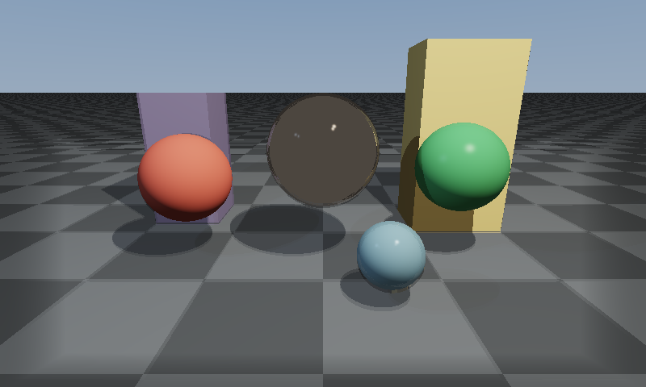

# Screen Space Reflections (SSR)

## 技术概述

本项目实现了一个完整的 **Screen Space Reflections (屏幕空间反射)** 渲染器，无需第三方库，纯 C++17 软光栅化。

## 算法原理

1. **Pass 1 — G-Buffer 构建**：软光栅化场景，将每个像素的世界坐标、法线、颜色、金属度、粗糙度存入 G-Buffer
2. **Pass 2 — SSR 光线步进**：对每个高金属度像素，计算反射方向，在屏幕空间沿反射矢量步进，找到与 G-Buffer 深度缓冲的相交点
3. **Pass 3 — 混合输出**：将反射颜色按 Fresnel + 边缘衰减 + 距离衰减 混合到直接光照结果中

## 场景构成

- 金属地面（金属度0.9，棋盘格纹理，SSR 效果最明显）
- 中央镜面金属球（金属度1.0）
- 左侧红色漫射球
- 右侧绿色半金属球
- 左后方紫色金属盒子
- 右后方橙色漫射盒子
- 前景蓝色小球

## 编译运行

```bash
g++ main.cpp -o output -std=c++17 -O2 -Wall -Wextra
./output
# 生成 ssr_output.ppm，用 Python 转为 PNG：
# python3 -c "from PIL import Image; Image.open('ssr_output.ppm').save('ssr_output.png')"
```

## 输出结果



## 技术要点

- G-Buffer 软光栅化（世界坐标、法线、深度缓冲）
- 屏幕空间光线步进（指数步长增长，减少步数）
- 深度比较（带厚度容差防止错误相交）
- 边缘衰减（屏幕边缘反射渐隐）
- 距离衰减（远处反射渐弱）
- 粗糙度衰减（高粗糙度材质反射减弱）
- ACES Filmic 色调映射
