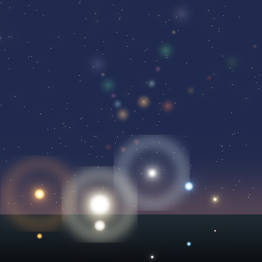

# Physically Based Bloom & Lens Flare

A C++ renderer demonstrating physically-based post-processing effects used in modern PBR pipelines.

## Features
- **Multi-level Bloom**: Brightness threshold extraction + 4-level Gaussian blur pyramid (downscale/blur/upscale)
- **Lens Flare**: Starburst diffraction pattern, ghost reflections along the lens axis, chromatic halos
- **HDR Scene**: Night sky with multiple colored light sources, stars, and ground reflections
- **Tone Mapping**: ACES filmic approximation + gamma correction for LDR output

## Compile & Run
```bash
g++ main.cpp -o output -std=c++17 -O2
./output
```

## Output


## Key Techniques
- Bright-pass filter: luminance-based threshold extraction
- Multi-resolution blur pyramid: 4 levels (full, 1/2, 1/4, 1/8 resolution)
- Lens flare ghosts: N reflected discs along screen-center axis with color tints
- Starburst: 6-ray diffraction via `cos^40(theta)` spike function
- Halo: Gaussian ring profile around light sources
- ACES filmic tone mapping + sRGB gamma correction
