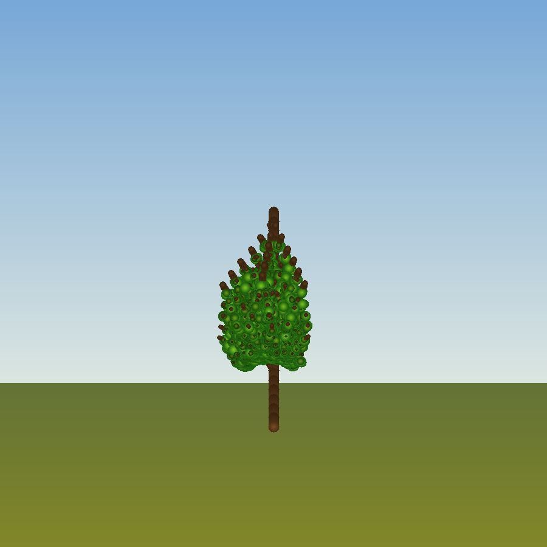

# L-System Procedural Tree Renderer

**日期**：2026-04-23  
**技术标签**：L-System, Lindenmayer, 程序化生成, 分形树, 龟形图形学, C++, 软光栅化

## 项目简介

基于 L-System（Lindenmayer系统）的程序化树木生成与渲染。L-System 通过递归字符串重写规则模拟植物生长，配合龟形图形学（Turtle Graphics）解释器将符号串转换为3D几何结构，最后通过自制软光栅化器渲染为图像。

## 编译运行

```bash
g++ main.cpp -o output -std=c++17 -O2 -Wall -Wextra
./output
# 生成 lsystem_tree_output.png
```

**要求**：stb_image_write.h（放在 ../../stb_image_write.h 相对路径）

## 输出结果



## 核心算法

### 1. L-System 语法

```
公理：FFFFA
规则：A → FF[&+A][&-A][&\A][&/A]FA
```

符号含义：
- `F` = 向前画枝条
- `[` / `]` = 保存/恢复龟的状态（分支）
- `&` / `^` = X轴俯仰（Pitch up/down）
- `+` / `-` = Z轴偏航（Yaw left/right）
- `\` / `/` = Y轴滚转（Roll left/right）

6次迭代生成 ~89,843 字符的字符串，产生 27,347 个枝条段和 143,933 个叶片。

### 2. 龟形图形学解释器

每个龟状态包含：
- 当前位置（Vec3）
- 方向矩阵（Mat3，3列=right/up/forward）
- 枝条长度和像素半径

方向旋转使用 Rodrigues 旋转公式，支持绕任意轴旋转。

### 3. 枝条颜色映射

- 主干（generation 0-35%）：暖棕色 `(0.48, 0.30, 0.13)`
- 中枝（35-65%）：棕绿色渐变
- 细枝（65%+）：绿色 `(0.20, 0.38, 0.14)`

### 4. 叶片生成策略

对半径小于基础半径55%的枝条，按概率在枝条沿线散布叶片（4-9个/段），向枝条法向随机偏移，营造自然蓬松感。

### 5. 渲染

- 正交投影（带轻微3D视角倾斜）
- 画家算法（按深度排序，从后向前渲染）
- 圆形横截面叶片，带边缘暗化和中心亮化
- 渐变天空+地面背景

## 技术要点

1. **L-System字符串重写**：O(n)复杂度，支持多条规则，6次迭代产生指数级分支
2. **Rodrigues旋转**：绕任意轴的精确3D旋转，避免万向锁问题
3. **深度排序**：正交投影下的正确遮挡关系
4. **随机抖动**：枝条长度+5%、角度抖动增加自然感

## 渲染数据

- 图像尺寸：900×900 像素
- 枝条段：27,347
- 叶片：143,933
- 渲染时间：~0.20s
- 输出文件：92KB PNG
