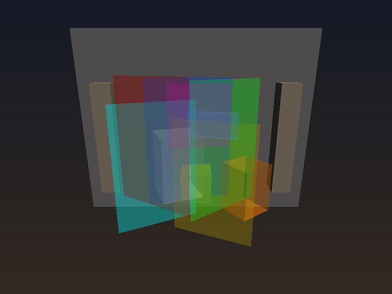

# Order-Independent Transparency (OIT)

## 技术说明

实现了 **Weighted Blended OIT**（McGuire & Bavoil 2013）——一种不依赖透明物体排序的实时透明渲染算法。

## 算法原理

传统透明渲染需要将透明物体从远到近排序（画家算法），在多物体重叠时无法给出正确的全局排序。OIT 通过加权累积解决此问题：

1. **Pass 1**：正常渲染不透明几何体（写入深度缓冲）
2. **Pass 2**：对每个透明片段，累积加权颜色 + 更新透射率（不排序、不写入深度）
   - `accum.rgb += litColor * alpha * w(z, alpha)`
   - `accum.a   += alpha * w(z, alpha)`
   - `reveal    *= (1 - alpha)`
3. **Pass 3**：合成
   - `dst = (accum.rgb / accum.a) * (1 - reveal) + background * reveal`

权重函数 `w(z, alpha)` 基于深度和透明度，越近越不透明的片段权重越高。

## 场景构成

- **不透明物体**：背景墙、地板、中央基座、左右柱子
- **透明物体**：6 个彩色面板（红/绿/蓝/黄/青/品红）、2 个玻璃盒子、1 个蓝色薄板

## 编译运行

```bash
g++ main.cpp -o output -std=c++17 -O2 -Wall -Wextra
./output
```

## 输出结果


