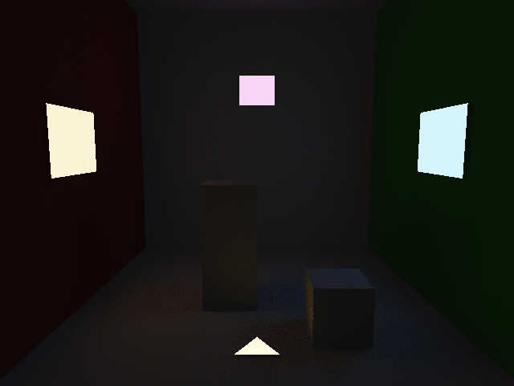

# ReSTIR Direct Illumination Renderer

基于 **ReSTIR（Reservoir-based Spatiotemporal Importance Resampling）** 的多光源直接光照渲染器。

## 技术要点

- **Weighted Reservoir Sampling (WRS)**: O(1) 在线流式采样，处理任意数量候选光源
- **Initial Candidate Sampling (RIS)**: 每像素采样 M=64 个候选光源，面积加权均匀采样
- **Spatial Reuse**: 组合 8 个邻域像素的 Reservoir，几何相似性过滤（法线 cos > 0.5, 深度差 < 1.0）
- **无偏贡献权重**: W = w_sum / (M × p̂(y))，确保无偏估计
- **多通道累积**: 5 次独立随机种子渲染取平均，降低 ReSTIR 噪声
- **ACES Filmic 色调映射**: 处理多光源 HDR 高亮区域
- **多色光源场景**: 5 个不同颜色/强度区域光（白色主光、橙色侧光、蓝色侧光、紫色背景光、黄色地面光）

## 编译运行

```bash
g++ main.cpp -o output -std=c++17 -O2 -Wall -Wextra
./output
# 输出: restir_output.ppm (640x480)
# 然后用 Pillow 转 PNG: python3 -c "from PIL import Image; Image.open('restir_output.ppm').save('restir_output.png')"
```

## 输出结果



## 算法流程

```
1. G-Buffer Pass: 光线追踪求交，记录 pos/normal/albedo/triIdx
2. 对每个着色点:
   a. 候选采样: 随机采样 64 个光源位置 → Reservoir 更新
   b. 空间重用: 遍历 8 个邻域，几何检验后合并 Reservoir
   c. 重计算 W = w_sum / (M × p̂(y))
   d. 最终着色: 执行可见性测试，计算 f × Li × G × W
3. 多通道累积 → ACES 色调映射 → Gamma 校正
```

## 参数

| 参数 | 值 |
|------|-----|
| 分辨率 | 640 × 480 |
| 初始候选数 M | 64 |
| 空间邻域数 | 8 |
| 累积通道数 | 5 |
| 光源数量 | 9 个发光三角形 |
| 运行时间 | ~17 秒 |
