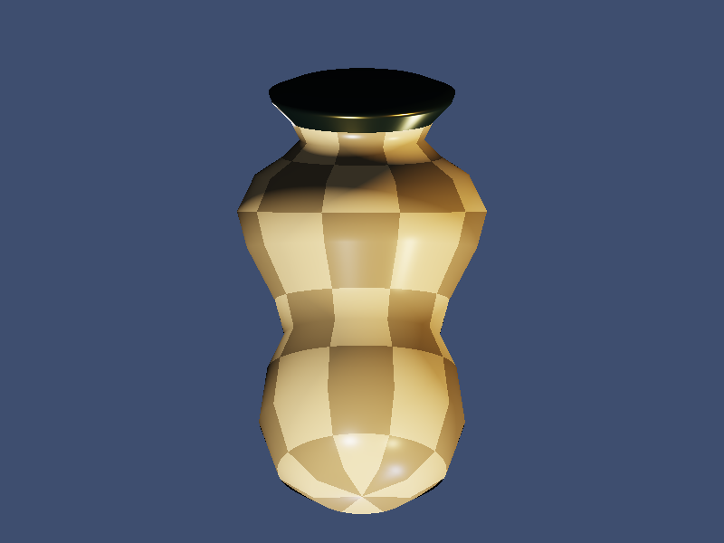

# OBJ Mesh PBR Renderer

A software rasterizer featuring OBJ mesh loading, MTL material parsing, and full PBR rendering pipeline.

## Features
- OBJ file parser (vertices, normals, UVs, polygonal faces with triangulation)
- MTL material file parser (Kd/Ks/Ns/Ka → PBR metallic-roughness conversion)
- Cook-Torrance BRDF (GGX NDF, Smith geometry, Fresnel-Schlick)
- Procedural vase mesh via surface of revolution
- Perspective-correct barycentric interpolation
- 3-point lighting (key + fill + rim) + point light with falloff
- ACES tone mapping + gamma correction
- Procedural checker & noise textures per material

## Compile & Run
```bash
g++ main.cpp -o output -std=c++17 -O2
./output
```

## Output


## Technical Notes
- GGX distribution: D(h) = α²/(π((n·h)²(α²-1)+1)²)
- Smith masking-shadowing: G = G₁(n·v)·G₁(n·l)
- Fresnel: F(v,h) = F₀ + (1-F₀)(1-v·h)⁵
- MTL shininess → roughness: r = √(2/(Ns+2)), clamped to [0.05, 1]
- Metallic derived from specular intensity: m = (Ksr+Ksg+Ksb)/3
