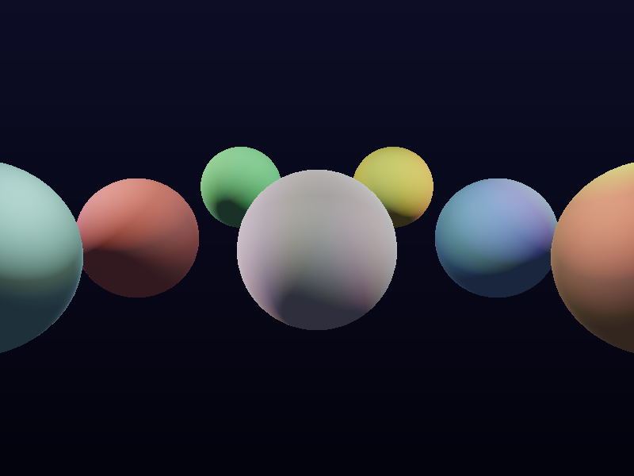
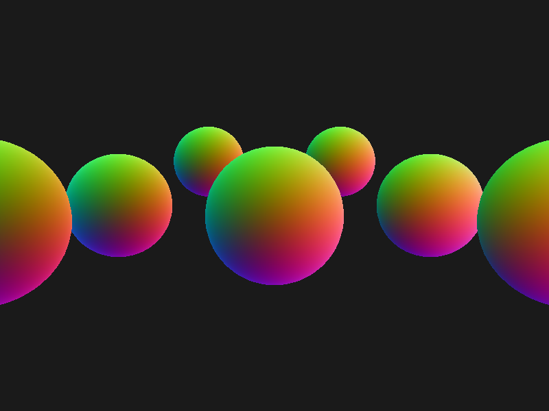

# Deferred Shading Multi-Light Renderer

延迟渲染管线实现，支持17个彩色点光源实时照明。

## 技术要点

- **G-Buffer 构建**：albedo / world-space normal / world-space position / depth
- **延迟光照**：Lighting Pass 逐像素读取 G-Buffer，Blinn-Phong 着色
- **多光源支持**：16个环绕彩色点光源 + 1个顶部主光源，光源影响范围剔除优化
- **距离衰减**：平方反比衰减 + 边缘平滑截断（edgeFade）
- **后处理**：逐通道 Reinhard 色调映射 + Gamma 2.2 校正
- **G-Buffer 可视化**：输出法线可视化图（gbuffer_normal.png）
- **软光栅化**：自实现透视投影 + 重心坐标插值 + 透视校正

## 编译运行

```bash
g++ main.cpp -o output -std=c++17 -O2 -Wall -Wextra
./output
# PPM 转 PNG（需要 PIL）
python3 -c "from PIL import Image; Image.open('deferred_shading_output.ppm').save('deferred_shading_output.png')"
```

## 输出结果





## 场景描述

- 8个彩色球体（银白、红、蓝、绿、金、紫、青、橙）
- 灰色地面平面
- 17个点光源（16环绕 + 1顶部主光），照亮整个场景
