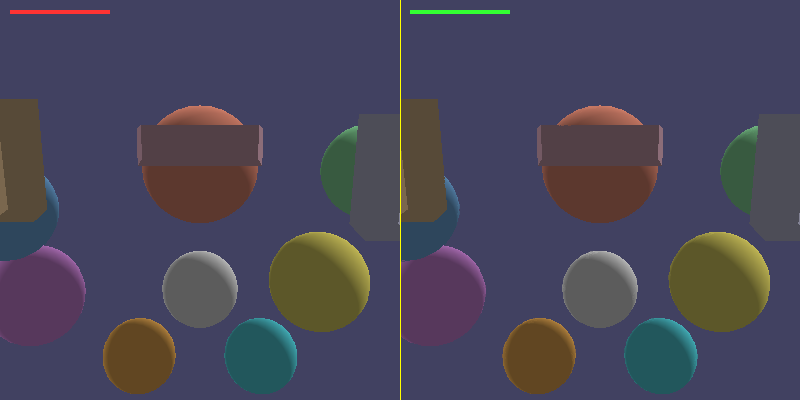

# FXAA Anti-Aliasing Post-Process Renderer

FXAA (Fast Approximate Anti-Aliasing) 后处理抗锯齿渲染器。软光栅化几何场景后应用 FXAA 算法消除锯齿，输出左右对比图（左=无FXAA，右=有FXAA）。

## 编译运行
```bash
g++ main.cpp -o fxaa_renderer -std=c++17 -O2
./fxaa_renderer
```

## 输出结果


## 技术要点
- 软光栅化：透视投影、重心坐标插值、Phong光照（漫反射+镜面反射）
- FXAA 核心：亮度(luminance)梯度检测边缘
- 边缘方向判定：水平/垂直方向梯度比较
- 子像素混合(Subpixel Aliasing)：消除细小锯齿
- 边缘端点搜索：沿边缘方向步进找到边缘终点，确定混合量
- 左右对比输出：黄色分割线分隔无FXAA（左）和有FXAA（右）
