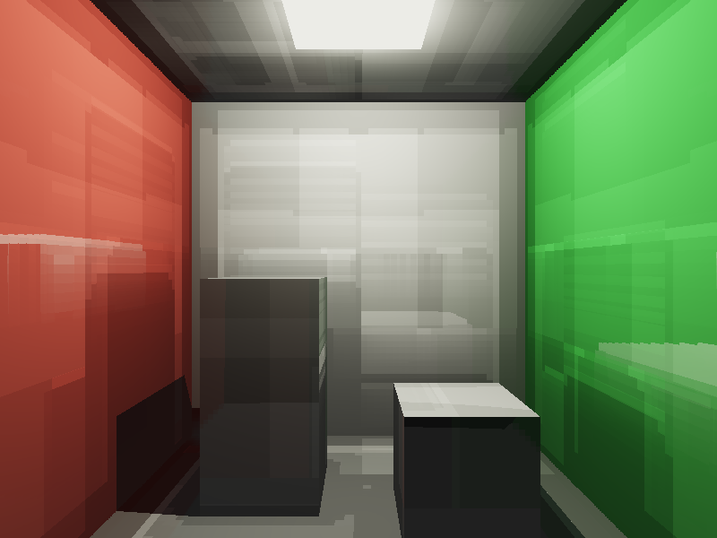

# VXGI - Voxel Global Illumination Renderer

基于体素锥追踪（Voxel Cone Tracing）实现的全局光照渲染器。将 Cornell Box 场景体素化为 64³ 网格，通过锥追踪实现漫反射GI、镜面GI和环境光遮蔽。

## 编译运行
```bash
g++ main.cpp -o vxgi_output -std=c++17 -O2 -lz
./vxgi_output
```

## 输出结果


## 技术要点
- 体素化：6方向射线检测，64³ 稀疏体素网格
- 直接光注入：预计算直接光照存储到体素
- 漫反射 GI：5条半球锥（孔径0.5rad），权重积分
- 环境光遮蔽（AO）：5条紧凑锥（孔径0.2rad），遮蔽累积
- 镜面 GI：单条反射方向锥
- 色调映射：ACES Filmic + Gamma 2.2
- PNG 输出：zlib 压缩，手写 PNG 格式
