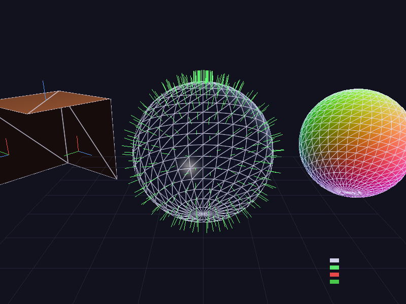

# Geometry Shader Effects Renderer

软光栅化实现几何着色器效果：线框叠加（Wireframe Overlay）、法线可视化（Normal Visualization）、切线空间（TBN）可视化。

## 编译运行
```bash
g++ main.cpp -o output -std=c++17 -O2
./output
```

## 输出结果


## 技术要点
- 重心坐标法计算三角形边缘距离，实现平滑线框叠加效果
- Phong 着色 + 线框混合的多 Pass 软渲染
- 法线可视化：球面法线映射为 RGB 颜色（法线贴图直观展示）
- TBN 切线空间三元组（T/B/N）箭头可视化
- Bresenham 直线算法绘制法线/切线箭头
- UV Sphere（16×24）和立方体网格生成
- 背面剔除 + Z-Buffer 深度测试
