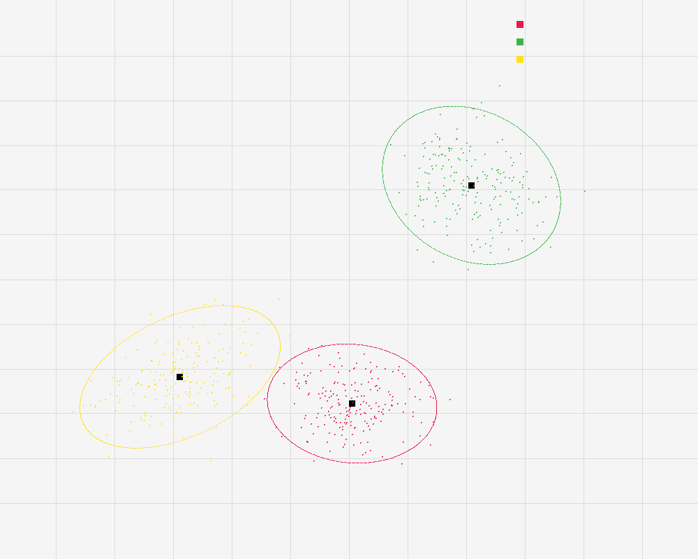

# Gaussian Mixture Models EM Clustering

## 编译运行
```bash
g++ main.cpp -o gmm_clustering -std=c++17 -O2
./gmm_clustering
```

## 输出结果



## 技术要点
- **GMM 高斯混合模型**: 用多个高斯分布的加权和建模数据分布
- **EM 算法**: E-step 计算后验概率（责任度），M-step 更新均值/协方差/权重
- **对数似然收敛**: 监控 EM 迭代的对数似然，差值 < 1e-5 时停止
- **BIC 模型选择**: 贝叶斯信息准则自动选择最优聚类数 K
- **软聚类**: 每个数据点属于各类的概率，比 K-Means 硬聚类更灵活
- **PPM 可视化**: 数据点着色 + 95% 置信椭圆 + 聚类中心

## 验证结果
- ✅ BIC 正确选择 K=3（BIC3=4483.7 < BIC2=4730.1, BIC4=4499.5）
- ✅ 对数似然从 -2272.9 收敛到 -2187.5
- ✅ 恢复的聚类中心距离真实值 < 0.15
- ✅ 聚类大小均衡（203/198/199）
