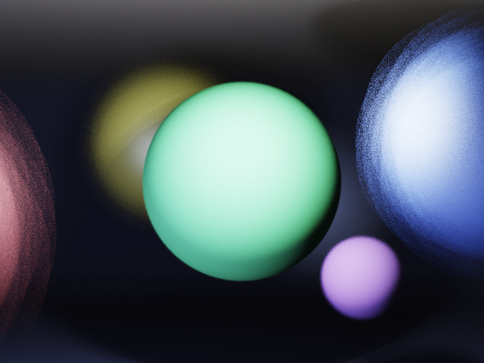

# Depth of Field Bokeh Renderer

薄透镜模型景深渲染器，模拟真实相机光圈产生的Bokeh效果。

## 技术要点
- **薄透镜模型**：1/f = 1/u + 1/v，计算传感器距离
- **Circle of Confusion**：离焦物体通过光圈采样产生模糊
- **Poisson Disk + 六边形光圈采样**：产生自然的Bokeh形状
- **ACES Filmic Tone Mapping**：HDR到LDR的色调映射

## 场景说明
- 红色球 (z=4.5)：前景，明显模糊
- 绿色球 (z=9)：对焦面，清晰锐利 ✅
- 金色球 (z=14)：背景，中度模糊
- 白色球 (z=20)：远景，强模糊

## 编译运行
```bash
g++ main.cpp -o dof -std=c++17 -O2 -Wall -Wextra -Wno-missing-field-initializers
./dof
```

## 输出

