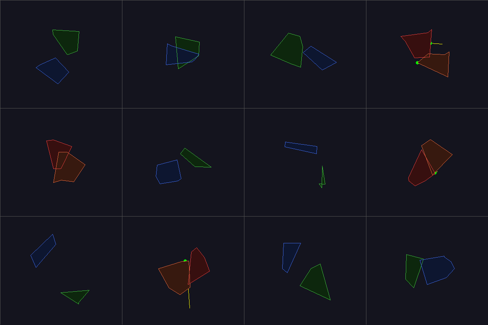

# GJK Collision Detection Visualizer

## 编译运行
```bash
g++ main.cpp -o output -std=c++17 -O2
./output
```

## 输出结果


## 技术要点
- GJK (Gilbert-Johnson-Keerthi) 算法：用于检测两个凸多边形是否相交
- EPA (Expanding Polytope Algorithm)：计算穿透深度和分离向量
- Minkowski 差：将碰撞检测转化为原点包含测试
- 单纯形迭代：从1-单纯形到3-单纯形的构建与判断
- 最近点计算：点到线段、点到三角形的最近点
