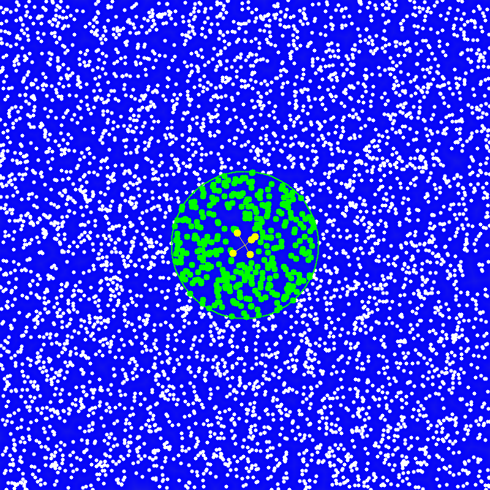

# Quadtree Spatial Partitioning Index

## 编译运行
```bash
g++ quadtree.cpp -o quadtree -std=c++17 -O2
./quadtree
```

## 输出结果


## 技术要点
- 四叉树空间分区索引数据结构
- 点插入与动态细分
- 范围查询（Rectangle Query）
- KNN最近邻搜索
- 暴力搜索基准对比，加速比验证
- PPM图像可视化输出
