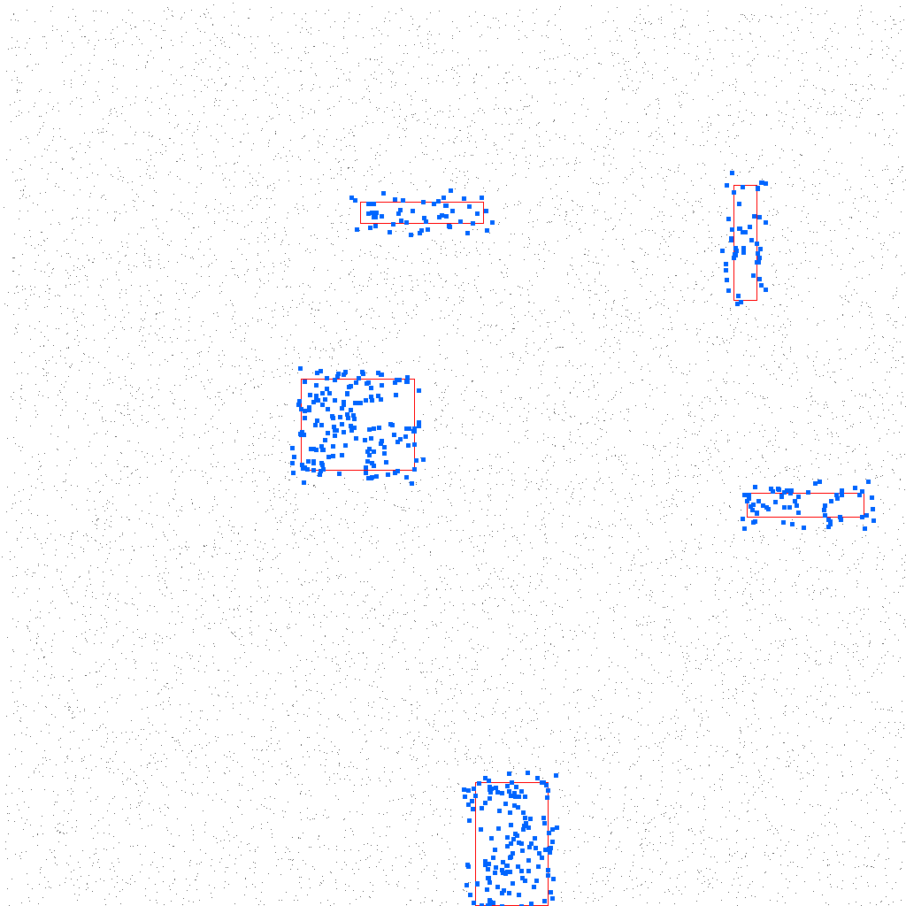

# R-Tree Spatial Index

## 编译运行
```bash
g++ main.cpp -o output -std=c++17 -O2
./output
```

## 输出结果


## 技术要点
- R-Tree 空间索引数据结构（Guttman 1984 经典算法）
- 矩形插入策略（ChooseLeaf + Node Splitting）
- 范围查询与 KNN 最近邻搜索
- 与暴力搜索基准对比（加速比验证）
- 可视化：查询矩形、结果点集、R-Tree MBR 层级
