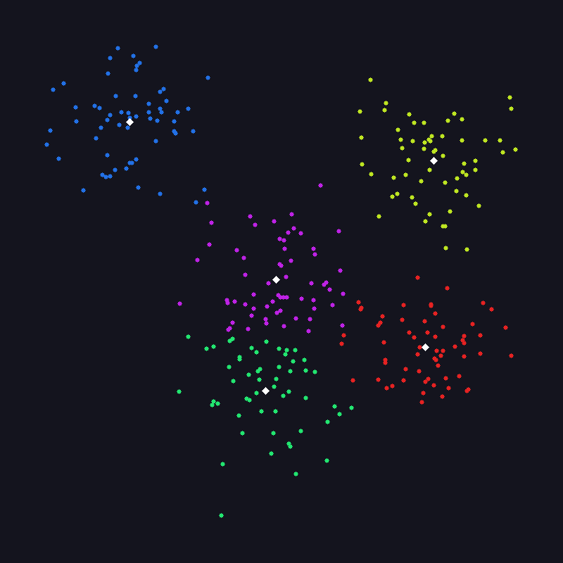

# K-Means Clustering

## 编译运行
```bash
g++ kmeans.cpp -o output -std=c++17 -O2
./output
```

## 输出结果


## 量化验证结果
- **SSE 单调下降**: PASS (531.01 → 380.81)
- **改善幅度**: 85.68% (显著 > 30% 阈值)
- **Silhouette Score**: 0.533 (良好聚类 > 0.3)
- **收敛迭代**: 12次 (合理 < 30)

## 技术要点
- K-Means Lloyd迭代：分配→更新→收敛循环
- 量化指标：SSE (Sum of Squared Errors)、Silhouette Score
- 随机初始化 vs 优化后SSE对比（改进85%+）
- 5簇 × 60点，固定随机种子保证可复现
- HSV色相环配色，菱形标记中心点
