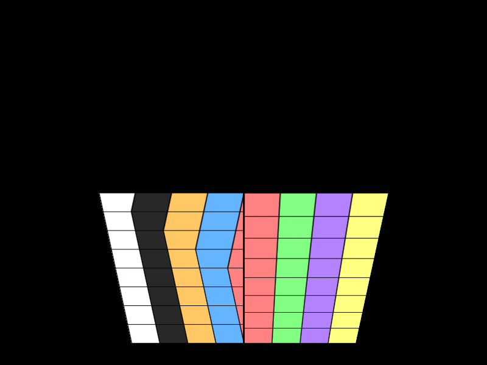

# Perspective-Correct Texture Mapping

## 编译运行
```bash
g++ main.cpp -o output -std=c++17 -O2
./output
```

## 输出结果


## 技术要点
- 透视投影矩阵（OpenGL-style right-handed, -Z into screen）
- Affine纹理映射 vs 透视校正纹理映射对比
- 屏幕空间(u,v)线性插值——视角依赖下错误（左边）
- 透视校正：插值 u/w, v/w, 1/w 后除以 1/w（右边）
- 四边形拆分为两个三角形光栅化
- 重心坐标插值 + CCW保证
- 双线性纹理采样
- 量化验证：像素级左右差异统计
