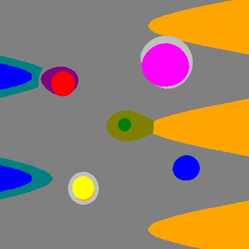
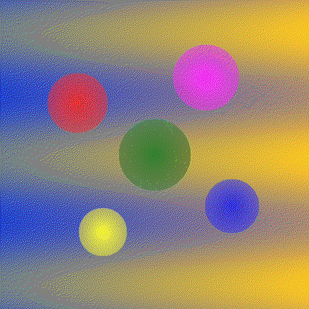
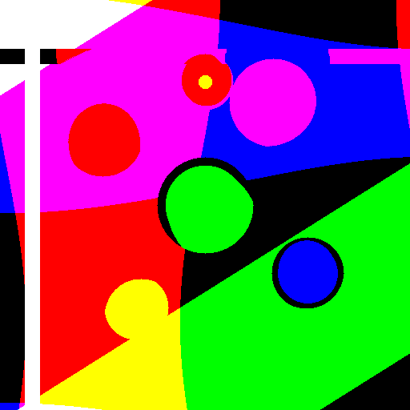
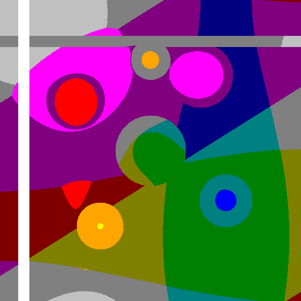
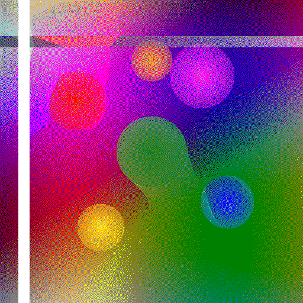
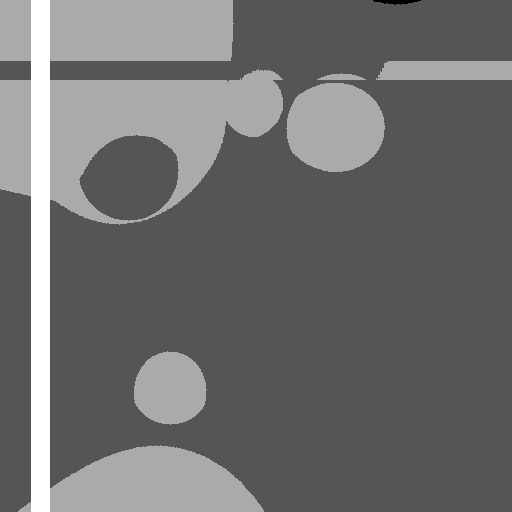
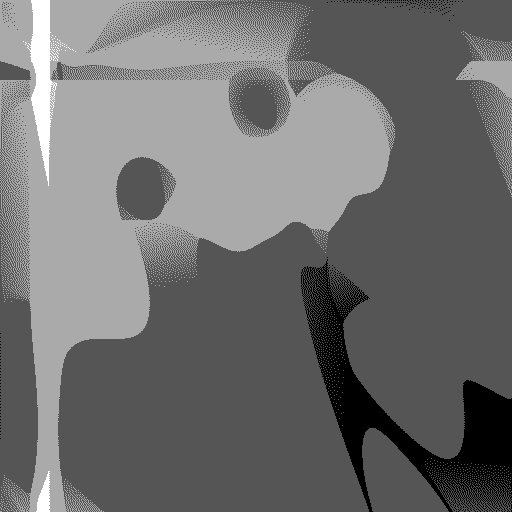
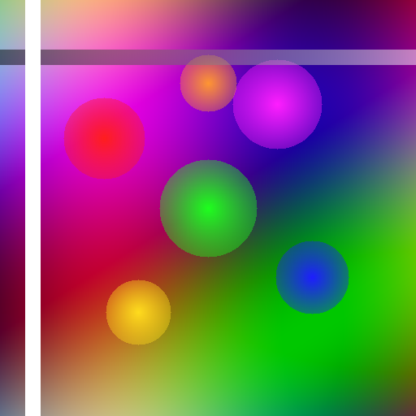

# Floyd-Steinberg Error Diffusion Dithering

## 概述

经典误差扩散抖动算法的 C++ 实现。通过将量化误差扩散到相邻像素，在减少颜色数的情况下保持视觉连续性，避免传统阈值量化的生硬过渡。

## 编译运行

```bash
g++ main.cpp -o dither -std=c++17 -O2
./dither
```

## 输出展示

### Web-Safe 调色板 (216色)
| 直接量化 | Floyd-Steinberg 抖动 |
|---------|---------------------|
|  |  |

### 8色调色板
| 直接量化 | Floyd-Steinberg 抖动 |
|---------|---------------------|
|  |  |

### Web 16色调色板
| 直接量化 | Floyd-Steinberg 抖动 |
|---------|---------------------|
|  |  |

### 4级灰度
| 直接量化 | Floyd-Steinberg 抖动 |
|---------|---------------------|
|  |  |

### 原始图像


## 技术要点

- **Floyd-Steinberg 误差扩散矩阵**：将当前像素的量化误差按 7/16、3/16、5/16、1/16 的比例分配到相邻未处理像素
- **浮点缓冲处理**：在浮点缓冲区中累积误差，避免量化时 clamp 引入的伪影
- **最近邻量化**：使用欧几里得距离从调色板中选择最接近的颜色
- **多调色板支持**：Web-Safe (216色)、16色、8色、4级灰度
