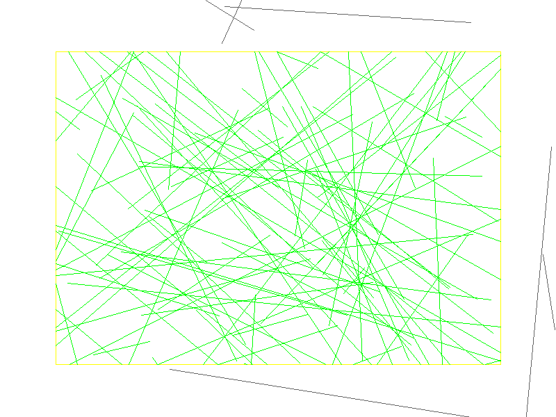

# Cohen-Sutherland Line Clipping

## 编译运行
```bash
g++ main.cpp -o cohen_sutherland -std=c++17 -O2 -Wall -Wextra
./cohen_sutherland
```

## 输出结果



## 量化验证结果

- 100条随机线段，Cohen-Sutherland 与 Liang-Barsky 算法 100% 一致
- 92条可见（经过裁剪框），8条完全被拒绝
- 算法一致率: 100/100 (100%)
- 平均裁剪后线段长度: 8.65

## 技术要点

- **Cohen-Sutherland 算法**: 使用4位区域编码(outcode)将平面划分为9个区域
- **区域编码**: bit 0=左, bit 1=右, bit 2=下, bit 3=上
- **平凡接受/拒绝**: 两端点都在内部时直接接受；两端点在同一外侧时直接拒绝
- **分段裁剪**: 计算线段与裁剪边界的交点，逐次缩短线段
- **Bresenham 直线绘制**: 用于 PPM 图像输出
- **Liang-Barsky 对照验证**: 使用参数化裁剪作为基准验证正确性
