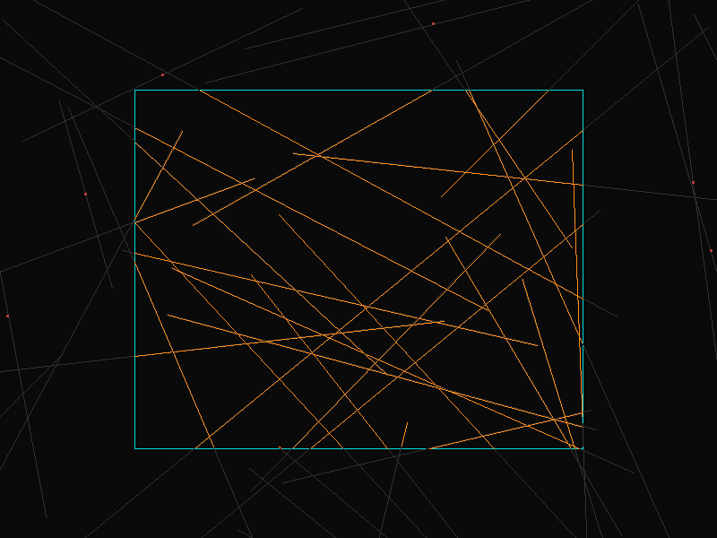

# Liang-Barsky Line Clipping

## 编译运行
```bash
g++ main.cpp -o output -std=c++17 -O2 -Wall -Wextra
./output
```

## 输出结果


## 技术要点
- Liang-Barsky 参数化直线裁剪算法 — 使用 P(t)=P0+t*(P1-P0) 参数方程表示直线
- 通过不等式测试 p_i * t <= q_i 直接计算裁剪参数 t_min/t_max
- 相比 Cohen-Sutherland 效率更高：无需区域编码，直接计算交点参数
- 可与 Cohen-Sutherland 交叉验证确保正确性（100K 随机直线零差异）
- 支持 Bresenham 直线绘制 + PPM/PNG 输出，暗色背景 + 彩色裁剪区域可视化
