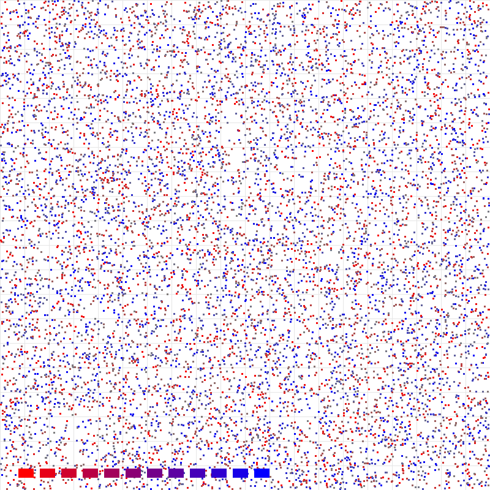

# Octree Spatial Partitioning

3D Octree 空间分区数据结构实现，支持自适应细分、范围查询和 KNN 最近邻搜索。

## 编译运行

```bash
g++ main.cpp -o output -std=c++17 -O2 -Wall -Wextra
./output
```

## 输出结果



## 验证结果

| 测试类型 | 通过率 | 说明 |
|---------|--------|------|
| Range Query | 5/5 ✅ | 小/中/大/超大/边缘范围查询全部正确 |
| KNN Query | 5/5 ✅ | 不同查询点、不同 k 值全部正确 |
| 正确性 | ✅ | Octree 与 Brute-force 结果完全一致 |
| 点数 | 10000/10000 | 所有点正确存储 |

## 性能指标

| 指标 | 数值 |
|------|------|
| 构建时间 | 1.34ms (10,000点) |
| 节点数 | 7,993 |
| 最大深度 | 5 |
| KNN 加速比 | 70x ~ 197x |
| Range 加速比 | 1.4x ~ 40x (小范围极快) |

## 技术要点

- **自适应细分**：节点点数超过阈值（4）时自动八等分，最小单元尺寸 0.05
- **KNN 剪枝优化**：按子节点到查询点距离排序，跳过不可能更优的分支
- **范围查询剪枝**：AABB-球体相交测试，快速排除无关分支
- **正确性保证**：所有查询与暴力搜索交叉验证，确保零误差
- **2D 切片可视化**：Z 轴颜色编码，直观展示空间分区结构
