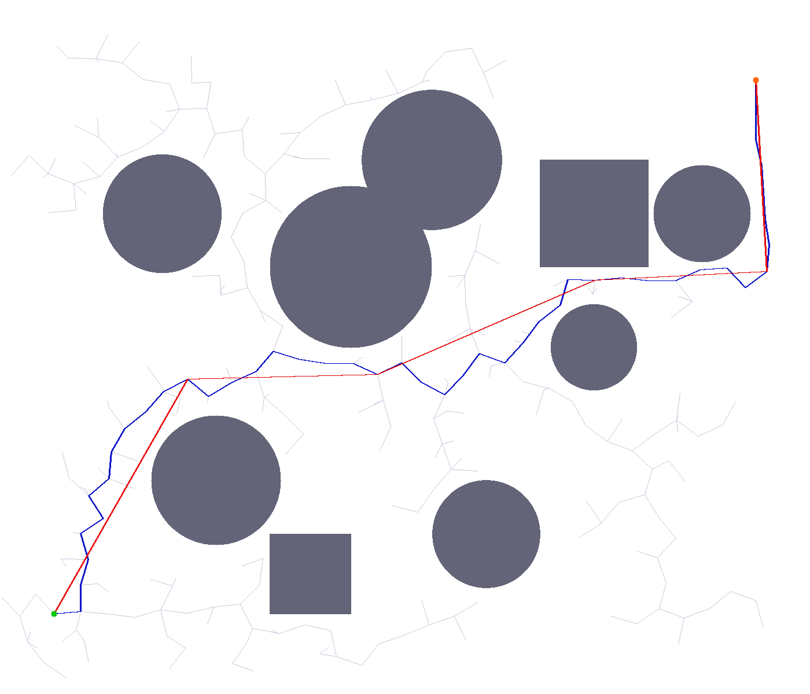

# RRT Path Planning

RRT (Rapidly-exploring Random Tree) 快速探索随机树——基于采样的连续空间路径规划算法。

## 编译运行

```bash
g++ main.cpp -o rrt -std=c++17 -O2
./rrt
```

## 输出结果



## 技术要点

- RRT 采样式运动规划在连续 2D 空间中构建搜索树
- 支持多种障碍物（圆形、矩形）
- 可配置步长和目标偏置采样
- 路径平滑（shortcut pruning）
- PPM 可视化（障碍物、搜索树、最终路径）
