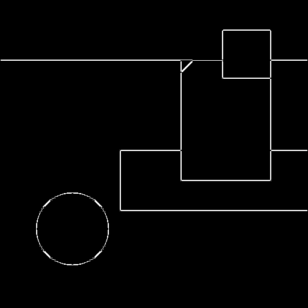
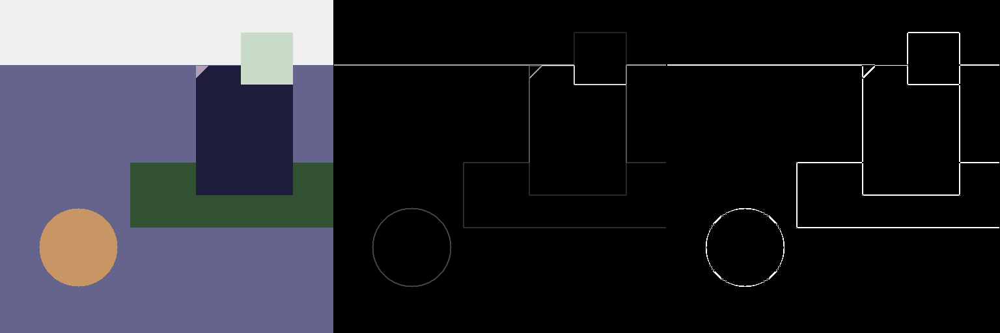

# Sobel Edge Detection

## 编译运行
```bash
g++ main.cpp -o sobel_edge -std=c++17 -O2
./sobel_edge
```

## 输出结果



## 技术要点
- Sobel 3x3 梯度算子（Gx, Gy）
- 梯度幅值 = sqrt(Gx² + Gy²)
- 梯度方向 = atan2(Gy, Gx)
- 非极大值抑制 (NMS)
- 双阈值 + 滞后边缘连接 (Hysteresis)

## 量化验证
- 边缘像素统计
- NMS 边缘细化率
- 滞后后最终边缘密度
