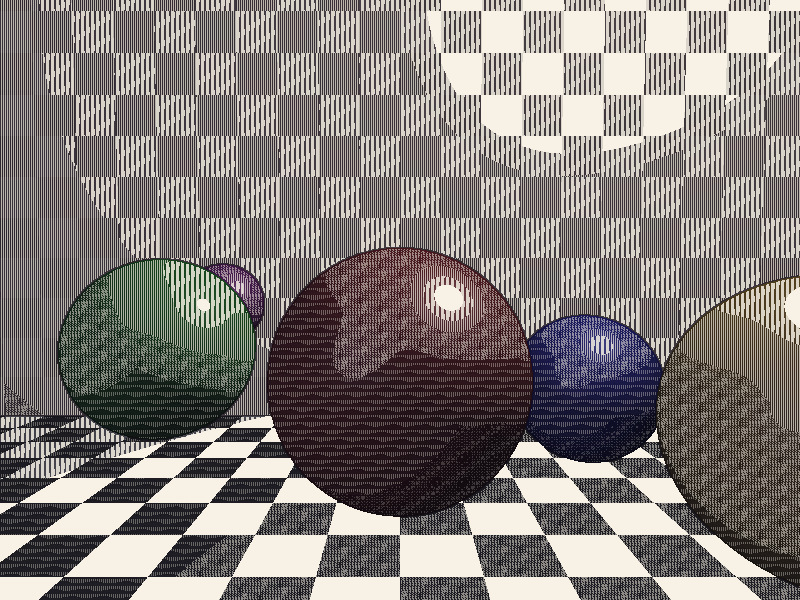

# Cross-Hatching NPR Renderer

非真实感渲染 (NPR)，使用交叉排线 (Cross-Hatching) 替代平滑着色来渲染 3D 场景。

## 编译运行

```bash
g++ main.cpp -o hatching_npr -std=c++17 -O2
./hatching_npr
```

## 输出结果



## 技术要点

- 交叉排线 (Cross-Hatching)：多层不同角度的排线叠加，产生色调渐变效果
- 色调分级 (Tonal Levels)：将连续光照量化为 6 级离散色调，每个色调对应不同的排线密度/角度组合
- 边缘检测：使用 Sobel 或梯度算子检测几何边界，叠加轮廓线增强形状感知
- 软光栅化：自实现三角形光栅化 + Phong 光照模型计算基础光照
- NPR 艺术风格：模拟手绘素描/版画的视觉效果，强调线条和纹理而非平滑着色
