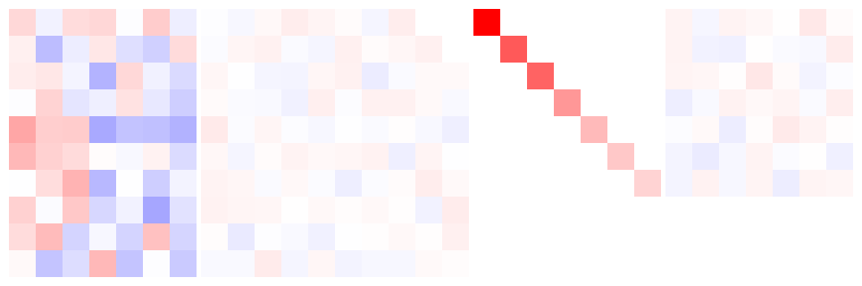

# SVD — Singular Value Decomposition

## 编译运行
```bash
g++ main.cpp -o output -std=c++17 -O2
./output
```

## 输出结果


## 技术要点
- **Two-step SVD method**: Compute A^T*A → Jacobi eigenvalue decomposition → V and S², then U = AV S^{-1}
- **Jacobi iterative diagonalization**: Classical Jacobi rotation with J^T*M*J similarity transformation
- **Gram-Schmidt orthogonalization**: Extend U to full m×m for tall matrices, with 3-pass reorthogonalization
- **Adaptive verification**: Stricter thresholds (1e-10) for full-rank matrices, relaxed (1e-6) for rank-deficient
- **5 test cases**: Square symmetric PD, tall rank-deficient, wide full-rank, random 8×6, rank-1 matrix

## 验证结果
All 5 test cases pass with the following checks:
- Reconstruction error: ||A - UΣV^T||_F / ||A||_F
- U and V orthogonality: max |U^TU - I|
- AV = US property: column-wise verification
- Singular value monotonicity
- Eigenvalue match: S² vs eigenvalues of AA^T
