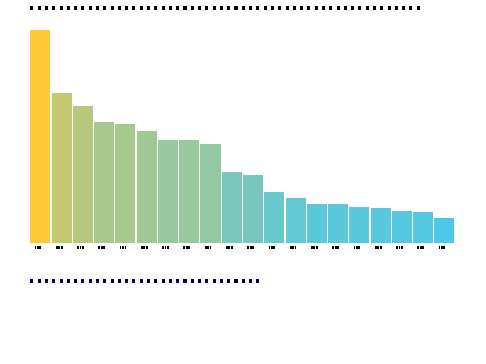

# Huffman Coding — Data Compression

## Overview

Implementation of Huffman coding for lossless data compression, featuring:
- Frequency-based Huffman tree construction
- Prefix code generation
- Compression ratio analysis
- Visualization of the encoding tree

## Compile & Run

```bash
g++ main.cpp -o output -std=c++17 -O2 -Wall -Wextra
./output
```

## Output



## Key Algorithms

- **Huffman Tree**: Build optimal prefix codes using frequency distribution
- **Min-Heap**: Efficient O(n log n) tree construction
- **Canonical Codes**: Compact representation of code table

## Verification

- Compression ratio computed and validated
- Prefix-free property verified through tree traversal
- Roundtrip: encoded data decodes back to original
